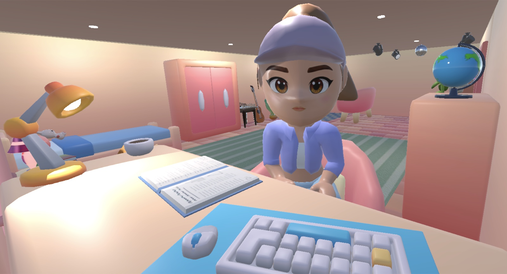
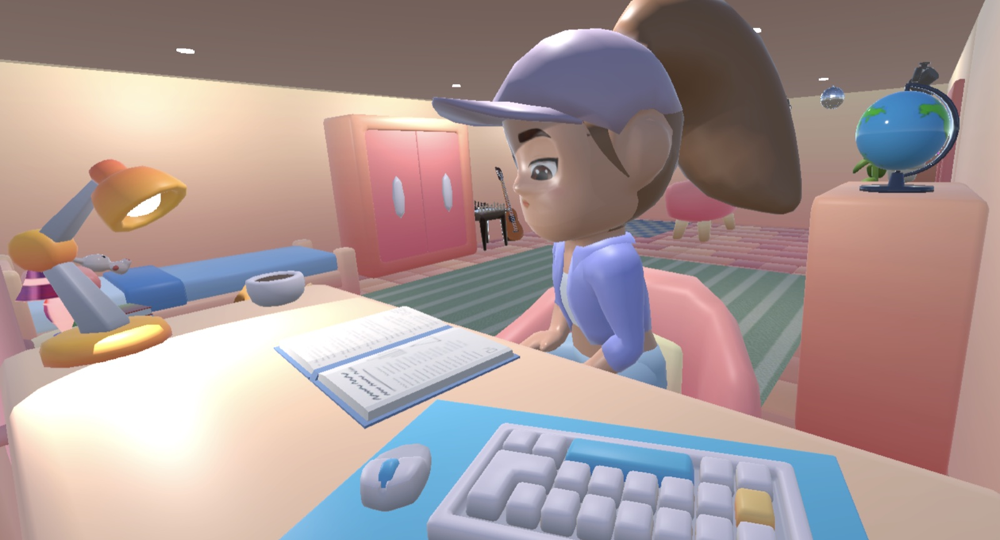
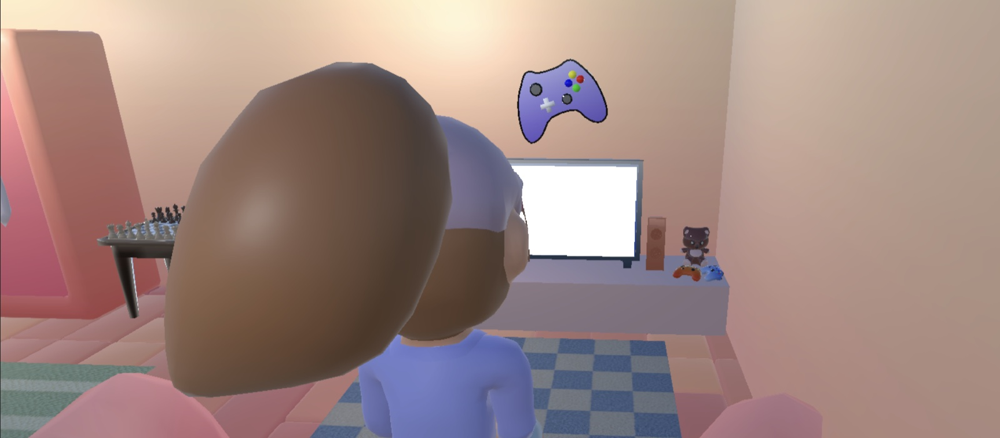
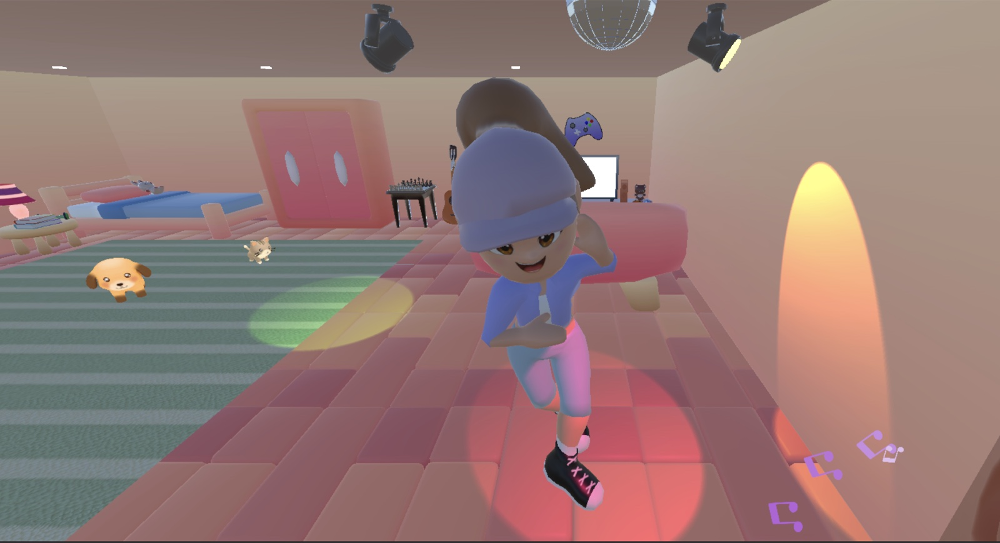
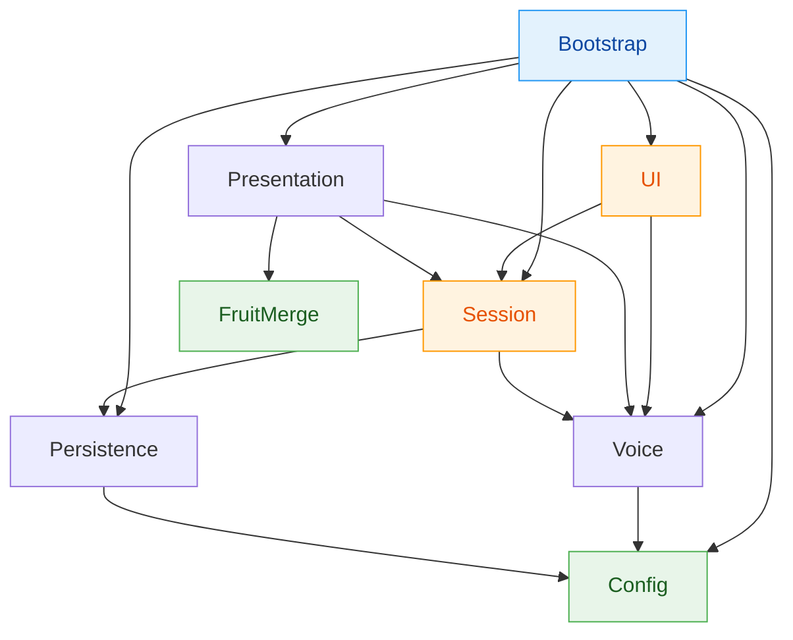

# Study With Me

**Seninle birlikte ders çalışan, sesli konuşan bir 3D oda arkadaşı.**

[](https://unity.com/releases/editor/whats-new/6000.0.80)
[](https://docs.unity3d.com/Packages/com.unity.render-pipelines.universal@17.0/manual/index.html)
[](https://ai.google.dev/gemini-api/docs/live)
[]()



---

## English summary

**Study With Me** is a Unity study-companion app. A 3D character named Chloe sits at her desk in her room and talks to you **by voice, in real time**, through the **Gemini Live API** — native audio-to-audio, push-to-talk with manual activity signalling, barge-in, live transcription and function calling. She remembers you between sessions through a local JSON profile that she populates herself by calling a `update_student_profile` tool mid-conversation, so the second time you open the app she greets you by name and refers back to what you told her.

She is not a talking head bolted onto a menu. Between conversations she turns to the book on her desk and reads it, page by page, reaching out with a two-bone IK arm to turn each page. On demand the room lights drop, four disco fixtures sweep the floor, the cat and the dog leave their patrol routes to circle the dance floor, and she dances. On demand again the camera pushes in on the TV and hands the whole screen to a merge-puzzle minigame loaded additively — while the voice WebSocket stays alive behind it.

It is a real, running vertical slice rather than a mockup: the voice loop, the memory, the character performance and all three room modes work end to end today. The conversational session flow (six states, break offers, ad bridge) is the next milestone and is documented as planned, not shipped. **The rest of this README is in Turkish.**

---

## İçindekiler

- [Proje nedir?](#proje-nedir)
- [Ekran görüntüleri](#ekran-görüntüleri)
- [Özellikler](#özellikler)
- [Nasıl çalışıyor?](#nasıl-çalışıyor)
- [Mimari](#mimari)
- [Klasör yapısı](#klasör-yapısı)
- [Kurulum](#kurulum)
- [Kullanım](#kullanım)
- [Editor araçları](#editor-araçları)
- [Proje durumu](#proje-durumu)
- [Teknik notlar](#teknik-notlar)
- [Mimari kurallar](#mimari-kurallar)
- [Krediler ve lisans](#krediler-ve-lisans)

---

## Proje nedir?

Study With Me, ders çalışırken yalnız hissetmemek için yapılmış bir Unity uygulaması. Ekranda odasında oturan **Chloe** var; onunla mikrofonla, gerçek zamanlı olarak Türkçe konuşuyorsun. Kazanma/kaybetme durumu yok — bu bir oyun değil, bir **çalışma arkadaşı uygulaması**.

Temel döngü şöyle işliyor: uygulamayı açıyorsun, Chloe seni karşılıyor. İlk defa tanışıyorsanız sohbetin doğal akışında adını, sınıfını, hangi sınava hazırlandığını, ne kadar süre çalıştığını öğreniyor — soru bombardımanı yapmadan. Öğrendiği her şeyi **kendisi kaydediyor**: konuşma sırasında bir fonksiyon çağırıyor ve profil diske yazılıyor. Bir dahaki açışında seni ismiyle karşılıyor ve geçmişe gönderme yapıyor.

Sen çalışırken o boş boş durmuyor. Masasındaki kitaba dönüp okuyor, sayfa çeviriyor. Canın sıkılırsa odayı diskoya çeviriyor. Mola vermek istersen kamera TV'ye yaklaşıyor ve ekranı bir meyve birleştirme mini oyununa devrediyor — arka planda sesli bağlantı hiç kopmadan.

---

## Ekran görüntüleri

### Konuşma — masasında, seni dinliyor


Chloe masasında oturuyor. Yüz ifadesi konuşma durumuna göre değişiyor: konuşurken 4 ağız hücresi arasında geçiş yapıyor, dinlerken/düşünürken sabit ifadeler kullanıyor. İfadeler 4x4'lük bir doku atlasından seçiliyor — kafada duran düz bir çıkartma, kemik animasyonu değil.

### Çalışma modu — kitabına dönüp okuyor



Konuşma yokken kitabına dönüyor. **Kafasını değil, gövdesini** çeviriyor — rig Generic olduğu için humanoid look-at yok, kafa kemiğini elle döndürmek Animator'ın üstüne ikinci bir yazar koymak demekti. Sayfa çevirirken sağ eli iki kemikli IK ile kitaba uzanıyor ve geri dönüyor; bu hareket için hazır bir animasyon klibi yok, tamamen hedef odaklı IK ile üretiliyor.

### Oyun modu — ekranı mini oyuna devrediyor



Kanepeye geçiyor, kamera TV'ye doğru bir yay çizerek yaklaşıyor (düz çizgi Chloe'nin kafasından geçtiği için yay), sonra Fruit Merge sahnesi **additive** olarak yükleniyor ve ekranı devralıyor. Oda sahnesi yaşamaya devam ediyor — sesli WebSocket bağlantısı ve Chloe'nin durumu korunuyor. `Esc` ya da köşedeki butonla geri dönülüyor.

### Dans modu — oda diskoya dönüyor



Tek bir saat ve bir Phase enum'ı tüm sekansı sürüyor: kamera değişimi → oda ışıkları sönüyor → disko rig'i, müzik ve nota parçacıkları → dans başlıyor → 120 saniye → müzik ve disko aynı karede duruyor → bir saniye sonra oda ışıkları, kamera ve masaya dönüş birlikte iniyor, böylece masaya ışınlanma hiç ekranda görünmüyor. Kedi ve köpek de rotalarını bırakıp dans pistinin çevresinde toplanıyor ve dönüp Chloe'ye bakıyor.

---

## Özellikler

### Gerçek zamanlı sesli konuşma

| | |
|---|---|
| **Protokol** | Gemini Live API üzerinden WebSocket ([NativeWebSocket](https://github.com/endel/NativeWebSocket)) |
| **Model** | `models/gemini-3.1-flash-live-preview` (yapılandırılabilir) |
| **Ses** | Native audio-to-audio — metne çevirip geri okutma yok, doğrudan ses akışı |
| **Konuşma sırası** | Manuel activity signalling (`activityStart` / `activityEnd`), otomatik VAD kapalı |
| **Barge-in** | Chloe konuşurken araya girebiliyorsun, oynatma kesiliyor |
| **Altyazı** | Hem kullanıcı hem model tarafı için canlı transkripsiyon |
| **Ses karakteri** | Gemini'nin `Leda` hazır sesi |
| **Dil** | System prompt Türkçe — Chloe Türkçe konuşuyor |

### Kalıcı hafıza — kendi kendini dolduran profil

Chloe hakkında bildiklerini **string eşleştirmeyle değil**, Gemini'nin function calling özelliğiyle kaydediyor. Konuşma sırasında bir bilgi öğrendiğinde `update_student_profile` fonksiyonunu çağırıyor, uygulama da bunu `ProfileMerger` üzerinden diske yazıyor:

```
studentName                    → adın
gradeOrClass                   → sınıf / bölüm
examTarget                     → hazırlandığın sınav veya hedef
usualStudyTime                 → genelde ne zaman çalıştığın
typicalSessionMinutes          → tek oturumda kaç dakika
preferredBreakFrequencyMinutes → kaç dakikada bir mola
totalStudySessions             → toplam oturum (otomatik)
totalStudyMinutes              → toplam dakika (otomatik)
```

Profil `Application.persistentDataPath` altında JSON olarak duruyor. Bir sonraki açılışta system prompt bu profilden yeniden kuruluyor — yani Chloe'nin "hafızası" prompt'a enjekte edilen bir özet.

### Karakter performansı

- **Yüz ifadeleri** — 4x4'lük atlas dokusundan hücre seçimi. Konuşma durumu (`Speaking` / `Listening` / `Thinking` / `Idle`), dans ve okuma için ayrı ifade setleri. Öncelik sırası: dans > konuşma > okuma, ve yüzün tek bir yazarı var.
- **Maskeli Animator katmanı** — gövde, boyun, kafa, kalça ve bacaklar taban katmandaki oturma animasyonundan; sadece iki kol zinciri maskeli `Arms` katmanından geliyor. Böylece konuşma animasyonunun öne eğilmesi kafayı kameradan kaçırmıyor ama jest korunuyor.
- **İki kemikli kol IK'sı** (`ArmIkSolver`) — rig Generic olduğu için Unity'nin humanoid IK'sı kullanılamıyor; analitik çözüm yazıldı. Bilek dahil çözülüyor, çünkü asıl şikayet bilekti.
- **Tek yazar kuralı** — kök transform'u sadece `CharacterPresenter` yazıyor. Dans ve oyun modu Chloe'yi taşırken `transform.position`'a dokunmuyor, `SetRestingPose()` üzerinden geçiyor.

### Oda modları

| Mod | Ne yapıyor | Nasıl başlıyor |
|---|---|---|
| **Çalışma** | Kitaba dönüp okuyor, IK ile sayfa çeviriyor | Ekrandaki toggle butonu |
| **Dans** | Işıklar, disko rig'i, müzik, 120 sn dans, hayvanlar partide | Ekrandaki buton (süre dolunca kendi biter) |
| **Oyun** | Kanepe → kamera yaklaşması → Fruit Merge devralıyor | Ekrandaki buton, `Esc` ile çıkış |

Üç mod da şu an butonlarla sürülüyor. Bunlar geçici: sesli oturum akışı yerine oturduğunda modları konuşma başlatacak, butonlar debug aracına dönüşecek.

### Ortam

- **Kedi ve köpek** — odada yazılmış duraklar arasında geziyorlar, her durakta belirli süre bekliyor ve istenirse belirli bir yöne dönüyorlar. Dans modunda rotalarını bırakıp pistin yanındaki dikdörtgen alanda toplanıyorlar.
- **Kitap** — masadaki kitap kendi sayfalarını çeviriyor. Çevrilen yaprak sadece çevirme anında görünüyor; altındaki sayfa örtülüyken sessizce değişiyor, böylece hiçbir şey ekranda geri sıçramıyor.

### Vendor'lanmış mini oyun — Fruit Merge

Ayrı bir Unity projesinden **bütün halinde** alınmış bir meyve birleştirme oyunu (`Assets/FruitMerge/`). Sarmalanmadı, parçalanmadı: kendi sahnesi, verisi, sanatı, sesi, UI'ı ve editor araçlarıyla geldi. İçindeki hiçbir şey bu uygulamanın varlığından haberdar değil.

Tek bağlantı noktası "sahnesini yükle, ekranı ona ver". Oyun modu dışarıdan sadece şunlara dokunuyor: oyunun kamerasının **culling mask**'i ve **viewport rect**'i, kök canvas'larının **render mode / world camera / plane distance** ayarları, yüklenen sahnenin **EventSystem**'inin açık/kapalı durumu ve **hangi sahnenin aktif** olduğu. Hepsi çalışma zamanında, taze yüklenen sahne üzerinde — hiçbiri diske yazılmıyor.

---

## Nasıl çalışıyor?

```
Kullanıcı mikrofona konuşur
        │
        │  Microphone.Start() → PCM16 16kHz parçalar
        ▼
GeminiLiveVoiceSession ──── WebSocket ────► Gemini Live API
        │                                          │
        │  activityStart / audio / activityEnd     │
        │                                          │
        │◄──────── ses akışı + transkripsiyon ─────┤
        │◄──────── toolCall ───────────────────────┘
        │
        ├──► ring buffer → AudioClip     (24 kHz oynatma)
        ├──► TurnStateChanged ──► CharacterPresenter  (yüz + animasyon)
        ├──► CaptionReceived  ──► altyazı log'u
        └──► ToolCallReceived ──► ProfileMerger ──► LocalJsonProfileRepository
                    │                                        │
                    └──► toolResponse (aynı karede) ◄─────────┘
```

Gelen her `toolCall`, aynı işleme turunda mutlaka bir `toolResponse` alıyor — bu bir mimari kural, opsiyonel değil.

---

## Mimari

Sistemler arası bağımlılıklar **tek yönlü**. `Config` ve `FruitMerge` saf yaprak, `Bootstrap` her şeye bağlanmaya izinli tek kök.



> Turuncu kutular (`Session`, `UI`) blueprint'te tanımlı ama henüz kodu yazılmamış sistemler.

| Sistem | Sorumluluk | Durum |
|---|---|---|
| **Config** | Gemini API key + model id (ScriptableObject, gitignore'da) | ✅ |
| **Voice** | WebSocket taşıma, mikrofon, oynatma, tool dispatch, barge-in | ✅ |
| **Persistence** | Profil şeması, yerel JSON deposu, merge-on-write | ✅ |
| **Presentation** | Karakter, kamera, modlar, hayvanlar, kitap, IK | ✅ |
| **Bootstrap** | Kompozisyon kökü — somut nesnelerin bağlandığı tek yer | ✅ |
| **Tooling** | Editor-only kurulum/ihraç scriptleri, build'e girmez | ✅ |
| **FruitMerge** | Vendor'lanmış mini oyun, kendi içinde kapalı | ✅ |
| **Session** | Altı durumlu akış makinesi, mola planlama | 🚧 planlandı |
| **UI** | Altyazı paneli, PTT butonu, metin girişi, HUD | 🚧 planlandı |

### Veri sahipliği

Her verinin **tek bir yazarı** var; ikinci bir yazar belirirse bu bir hata:

| Veri | Tek yazarı |
|---|---|
| `StudentProfile` alanları | `ProfileMerger` |
| Chloe'nin kök transform'u | `CharacterPresenter` |
| Chloe'nin kol kemikleri | `ArmIkSolver` (Animator'dan sonra, `LateUpdate`) |
| Chloe'nin yüz hücresi | `CharacterPresenter` (içeride kalır, dışarıdan hücre seçilmez) |
| Hayvanların transform'u | `PetRoamer` (agent-parent üzerinde, modelin kendisinde değil) |
| Sesli konuşma sırası | `GeminiLiveVoiceSession` |
| Mini oyunun durumu ve `Time.timeScale` | `GameManager` (vendor) |

---

## Klasör yapısı

```
Assets/
├── Scripts/
│   ├── Config/          GeminiApiConfig (ScriptableObject tanımı)
│   ├── Voice/           IVoiceSession, GeminiLiveVoiceSession,
│   │                    GeminiLiveMessages (wire DTO'ları), VoiceHarnessHud
│   ├── Persistence/     StudentProfile, IProfileRepository,
│   │                    LocalJsonProfileRepository, ProfileMerger
│   ├── Presentation/    CharacterPresenter, ArmIkSolver, DeskRoutine,
│   │                    BookPageTurner, DanceModeController,
│   │                    GameModeController, PetRoamer, mod butonları
│   └── Bootstrap/       RoomSessionController (kompozisyon kökü)
├── Editor/              Sahne kurulum ve ölçüm araçları (build'e girmez)
├── Scenes/
│   ├── Room.unity       Tek gerçek sahne — el ile kurulmuş (~171 nesne)
│   └── _Sandbox/        VoiceHarness.unity (ses spike'ı için test sahnesi)
├── Prefabs/             Chloe.prefab
├── Art/
│   ├── Character/       deneme.fbx — Blender'da yeniden kurgulanmış model
│   ├── chloe/           Mixamo klip FBX'leri + Animator controller + mask
│   │   └── Generated/   ChloeClipPathFixer'ın ürettiği .anim'ler
│   ├── Book/            Book.fbx
│   ├── Textures/        Yüz atlası, kitap sayfaları, halılar
│   └── material/        El ile yazılmış .mat dosyaları
├── Config/              GeminiApiConfig.asset  ← GITIGNORE'DA
├── Settings/            URP ayarları + StudyWithMeControls.inputactions
├── FruitMerge/          Vendor'lanmış mini oyun (bütün halinde)
├── Trip Hop Music/      Dans modu müziği
├── LowPolyBoy/          Vendor: oda paketi
├── ZNS3D/               Vendor: game room paketi
└── PolyOne/             Vendor: kedi ve köpek

.claude/                 Proje mimari dokümantasyonu
├── blueprint.md         Sistemler, sahneler, prefab'ler, klasörler
├── decisions.md         Mimari karar kaydı (ADR) — 51 karar
├── codemap-*.md         Dosya bazında sorumluluk / API / bağımlılık haritası
├── index.md             Sistem → konum tablosu
└── rules/               Alan kuralları

docs/screenshots/        Bu README'nin görselleri
```

---

## Kurulum

### Gereksinimler

- **Unity 6000.0.80f1** (Unity 6) — farklı bir sürümde açarsan Unity yükseltmek isteyecektir
- Bir **Gemini API key** — [Google AI Studio](https://aistudio.google.com/apikey)'dan ücretsiz alınıyor
- Mikrofon
- macOS veya Windows (şu an sadece Editor / Standalone hedefleniyor)

### 1. Klonla ve aç

```bash
git clone https://github.com/hilmierkamgurbuz/study_with_me.git
cd study_with_me
```

Unity Hub → **Add** → klasörü seç → Unity 6000.0.80f1 ile aç. İlk açılış paket çözümlemesi ve import yüzünden birkaç dakika sürer.

### 2. Gemini API key'ini gir

> [!IMPORTANT]
> API key **hiçbir zaman koda gömülmez ve repoya girmez.** Key'i tutan asset dosyası `.gitignore`'da, bu yüzden klonladığında o dosya yok — kendin oluşturuyorsun.

1. Unity'de **Project** penceresinde `Assets/Config` klasörüne sağ tıkla
2. **Create → StudyWithMe → Gemini API Config**
3. Dosyaya **`GeminiApiConfig`** adını ver — yolu tam olarak `Assets/Config/GeminiApiConfig.asset` olmalı
4. Inspector'da:
   - **Api Key** → AI Studio'dan aldığın key
   - **Live Model Id** → `models/gemini-3.1-flash-live-preview` (varsayılan geliyor)
5. `Room.unity` sahnesini aç, `GeminiLiveVoiceSession` bileşenini bul ve **Config** alanına bu asset'i sürükle

Bu asset'i commit etmeye çalışırsan git zaten yok sayar. Yine de kontrol etmek istersen:

```bash
git check-ignore -v Assets/Config/GeminiApiConfig.asset
```

> [!WARNING]
> Live API model id'leri preview seviyesinde ve dönüyor. Bağlantı kurulmuyorsa önce [model listesini](https://ai.google.dev/gemini-api/docs/models) kontrol et. Belgelenmiş yedek: `models/gemini-2.5-flash-native-audio-preview-12-2025`.

### 3. Mini oyunun proje ayarlarını uygula

Fruit Merge'in katman indeksleri sahnesine ve prefab'ına gömülü olduğu için katman adlarının doğru slotlara oturması gerekiyor:

**Tools → Fruit Merge → Apply Import Settings**

Bu komut şunları yapıyor (hepsi idempotent, doğru olan değeri tekrar yazmıyor):
- Layer 6 = `Fruit`, Layer 7 = `Wall`, Layer 8 = `Room`
- Sprite packer'ı Sprite Atlas V2'ye alıyor
- `Game.unity`'yi Build Settings'e **ekliyor** — asla 0. indekse değil, çünkü 0 build'in açılış sahnesi ve orası `Room.unity`

### 4. Çalıştır

`Assets/Scenes/Room.unity`'yi aç ve Play'e bas.

---

## Kullanım

| Eylem | Nasıl |
|---|---|
| Chloe'ye bağlan | Sol üstteki **"Chloe'ye bağlan"** butonu |
| Konuş | **"Konuşmak için tıkla"** — bir kez tıkla konuş, tekrar tıkla bırak (toggle) |
| Araya gir | O konuşurken tıkla, sözünü kesebilirsin |
| Altyazıları gör | Butonun altındaki log alanı |
| Çalışma modu | **"Ders Çalış"** butonu — tekrar basınca **"Çalışmayı Bitir"** |
| Dans modu | **"Dance Mode"** butonu — 120 saniye sonra kendi biter |
| Oyun modu | **"Oyun Oyna"** butonu, çıkış için `Esc` ya da köşedeki geri butonu |

Sol üstteki bağlantı arayüzü `OnGUI` ile çizilen geçici bir debug arayüzü. Gerçek UI (altyazı paneli, basılı tut butonu, metin girişi) `UI` sisteminin görevi ve henüz yazılmadı.

**Profilini sıfırlamak istersen:** `Application.persistentDataPath` altındaki profil JSON'unu sil. macOS'ta:

```
~/Library/Application Support/<şirket>/<ürün>/
```

---

## Editor araçları

Hepsi editor-only, build'e girmiyor.

| Menü | Ne yapıyor |
|---|---|
| **Tools → StudyWithMe → Set Up Game Mode** | Oyun modunun nesnelerini `Room.unity`'de kuruyor ve bağlıyor. Yeniden çalıştırılabilir; elle sürüklediğin butonları yerinden oynatmıyor. |
| **Tools → StudyWithMe → Set Up Desk Routine** | Kol IK rig'ini ayağa kaldırıyor, çalışma rutinini bağlıyor. Her kolun **erişim mesafesini metre cinsinden raporluyor** — bu rapor tasarım tartışmalarını bitiren şey. |
| **Tools → StudyWithMe → Set Up Book Pages** | Kitabın sayfalarını giydiriyor ve mesh'lerini ölçüyor. Yarısı ölçüm aracı: her renderer'ın submesh sayısını, materyal slotlarını ve gerçek UV sınırlarını raporluyor. |
| **Tools → StudyWithMe → Rebind Clip Paths To Model** | Mixamo klip FBX'lerini modelin gerçek hiyerarşisine göre yeniden bağlayıp `Art/chloe/Generated/` altına bağımsız `.anim` olarak yazıyor. |
| **Tools → StudyWithMe → Create Voice Harness Scene** | Ses taşıma katmanını izole test etmek için sade bir sahne kuruyor. |
| **Tools → StudyWithMe → Export Chloe Used Region** | Karakter mesh'inin UV adalarını PNG maske olarak dışa aktarıyor. |
| **Tools → StudyWithMe → Log Chloe Face UV Bounds** | Yüz submesh'inin gerçek UV sınırlarını konsola yazıyor. |
| **Tools → Fruit Merge → Apply Import Settings** | Yukarıdaki kurulum adımı 3. |
| **Tools → unity-dev → Export unitymap / assetmap** | Sahne ve asset envanterini `.claude/` altındaki haritalara yazıyor. |

---

## Proje durumu

Bu bir **dikey dilim** (vertical slice) — uçtan uca çalışan gerçek bir sürüm, ama ürünün tamamı değil.

### Çalışıyor

- ✅ Gerçek Gemini Live sesli konuşma — bağlantı, mikrofon, akışlı oynatma, barge-in
- ✅ Manuel activity signalling ile basılı-tut mantığı
- ✅ Function calling ile profil güncelleme
- ✅ Yerel JSON profil kalıcılığı ve oturumlar arası süreklilik
- ✅ Oturum istatistikleri (toplam oturum, toplam dakika)
- ✅ Konuşma durumuna bağlı yüz ifadeleri ve animasyon
- ✅ İki kemikli kol IK'sı + sayfa çevirme jesti
- ✅ Çalışma / dans / oyun modları
- ✅ Kedi ve köpek dolaşımı, dans modunda parti davranışı
- ✅ Fruit Merge mini oyununun additive entegrasyonu

### Henüz yok

- 🚧 Altı durumlu oturum akış makinesi (Onboarding → SessionStart → SessionActive → BreakOffer → AdBridge → SessionEnd)
- 🚧 Mola teklifi ve reklam köprüsü (stub)
- 🚧 Gerçek UI katmanı — şu an `OnGUI` debug arayüzü var
- 🚧 Oturum sonu Gemini özetlemesi (`GeminiSessionSummarizer`)
- 🚧 Modların konuşma tarafından sürülmesi (şimdilik butonlar)

### Yayın hedefi (bu dilimin dışında)

Android + iOS + WebGL · cihaz diline göre çok dillilik · abonelik modeli · final karakter sanatı · API key yerine backend'den gelen efemeral token · ölçekte maliyet için zincirlenmiş STT/LLM/TTS hattı · opsiyonel backend profil senkronizasyonu.

---

## Teknik notlar

Projenin ilginç kısmı çoğunlukla "neden böyle yapıldı" kısmında. Tüm kararlar gerekçeleriyle `.claude/decisions.md` içinde (51 kayıt); birkaç örnek:

**Klip seçmek asla işe yaramayacaktı.** Chloe'nin klavyeye uzanması için üç tur boyunca uygun bir animasyon karesi arandı. Ölçüm tartışmayı bitirdi: yazma klibi 17.6 saniyesinin tamamında klavyeden **0.50 m uzakta** ve hiçbir kare bir **bileği** döndüremez — asıl şikayet de zaten oydu. Sonuç: analitik iki kemikli IK yazıldı. Sonrasında `ArmIkSolver`'ın erişim raporu daha da net bir sayı verdi — kolu **0.259 m** uzanıyor, klavye **0.70–0.81 m** ötede. Bilgisayar başında yazma davranışı tamamen silindi, çalışmak "okumak" olarak tanımlandı.

**Yüz kaymasının sebebi rig değil, dokuymuş.** Yüz çıkartmasının kafada kayması önce kemik ağırlıklarına yorulup düzeltildi — ve bu **yanlış** çıktı. Altındaki yüzeyin ağırlıkları ölçüldüğünde 0.126–0.866 arasında değiştiği, yani kafanın rijit dönmeyip deforme olduğu görüldü; çıkartmanın orijinal ağırlıkları o yüzeyi vertex bazında zaten neredeyse birebir takip ediyordu. Değişiklik geri alındı, model overwrite'tan hemen önce alınan kopyadan byte-byte geri yüklendi. Gerçek sebep atlas dokusuydu: 4. satır 1. satırdan bir hücrenin 0.147'si kadar yukarıdaydı. Doku hizalandı, rig'e hiç dokunulmadı.

**Hayvanlar için "agent-parent" deseni.** PolyOne klipleri animasyonlu nesnenin **kendi** transform'unun üç kanalını da her karede yazıyor — pozisyonu (0,0,0)'a, rotasyonu birime, **ve ölçeği (1,1,1)'e**. İlk turda ölçek kanalı gözden kaçtı: pozisyon ve rotasyon gürültülü şekilde bozuluyordu (hayvan dünya orijinine ışınlanıyordu), ölçek ise sessizce Play'de kediyi ~3.5 katına şişiriyordu. Çözüm: hareket ve animasyon **farklı transform'lara** sahip olsun — boş bir `Cat`/`Dog` ebeveyni hareketi ve dünya yerleşimini taşıyor, vendor modeli altında yerel sıfırda duruyor.

**Parti alanı bir dikdörtgen, çünkü dışbükeylik obstacle avoidance demek.** Hayvanlar NavMesh kullanmıyor, düz çizgide gidiyor. Dikdörtgen dışbükey olduğu için iki iç nokta arasındaki düz çizgi de içeride kalıyor — engeli alanın dışında tutmak yolları da temizliyor. İlk sürüm Chloe'yi alanın **içinde** bırakmıştı ve bu sessizce dışbükeylik argümanını bozuyordu: onu dışlamak bir halka gerektirir, halka dışbükey değildir, düz yollar delikten geçer. Alan onun **yanına** taşındı; clearance testi kapalıyken 5000 simüle yol hiç 0.77 m'den yakına gelmedi.

**Mini oyun dikey kalıyor.** Yatay ekranda oyun esnemiyor, **yayılıyor**: `CameraFit` tahtayı sabit dünya boyutunda tutuyor, HUD ise Screen Space Overlay olduğu için viewport'u görmüyor ve 16:9 pencerenin köşelerine uzanıyor. Sadece kamerayı kısıtlamak yarısını çözerdi; oyunun kök canvas'ları da kameraya yeniden bağlanıyor. Sıra da önemli — canvas'lar ve kamera farklı sahne köklerinde, bu yüzden toplama döngüsünün içinde bağlamak `worldCamera`'yı null bırakıyordu ve `worldCamera` null olan bir ScreenSpaceCamera canvas'ı **tam olarak** Overlay gibi davranıyor, yani düzeltmek istediği hatayı sessizce yeniden üretiyordu.

**Oda kendi katmanına çalışma zamanında taşınıyor.** Fruit Merge kamerası ortografik ve 16:9'da x −9.8..9.8 arasını kaplıyor; oda x≈11'den başlıyor, çakışma yok. Ama 21:9'da yarı genişliği 12.8'e çıkıp odanın TV köşesini kesiyor ve oda oyunun arka plan sprite'ından daha yakın olduğu için derinlik testini kazanıp görünüyor. Oyun değil **oda** taşınıyor, çünkü oyun çalışma zamanında default katmanda nesne üretiyor ve o katmanı culling'lemek oyunun parçalarını silerdi.

---

## Mimari kurallar

Bu kurallar projede pazarlık konusu değil:

- İçerik verisi (sayılar, eğriler, tablolar, metin) **koda gömülmez**, veriden okunur.
- Her verinin **tek bir yazarı** vardır; ikinci bir yazar belirirse kod durur.
- Sistemler arası bağımlılık okları **tek yönlüdür**.
- `StudentProfile` alanlarını **yalnızca** `ProfileMerger` yazar.
- UI ve Presentation kodu, Session ve Voice'un **arayüz ve event'lerine** bağlıdır — somut `GeminiLiveVoiceSession`'a, Newtonsoft'a veya NativeWebSocket tiplerine değil.
- Gemini API key'i **yalnızca** gitignore'daki `Assets/Config/GeminiApiConfig.asset` içinde yaşar; commit edilen hiçbir script'te sabit key bulunmaz.
- Yapılandırılmış kullanıcı kararları (çalışma süresi, mola niyeti, tanışma bilgileri) **function calling** ile çözülür — transkript metninde string/keyword eşleştirmesiyle değil.
- Gelen her `toolCall`, aynı işleme turunda bir `toolResponse` alır.
- `Assets/FruitMerge/` **vendor kodudur**, bizim değil. O ağaçtaki hiçbir dosya düzenlenmez; tek istisna port edilen `PointerInput.cs`. Oyunun tipleri (`GameManager`, `CameraFit`, `SaveService`, …) uygulama kodundan **hiç** referans edilmez — ne çağrıyla, ne `using` ile.

---

## Krediler ve lisans

### Üçüncü taraf kod

| | |
|---|---|
| [NativeWebSocket](https://github.com/endel/NativeWebSocket) | WebSocket taşıma — Editor/Standalone/mobil ve ileride WebGL için tek API |
| [Newtonsoft.Json for Unity](https://docs.unity3d.com/Packages/com.unity.nuget.newtonsoft-json@3.2/manual/index.html) | Gemini wire protokolü — sunucu zarfı derin opsiyonel alanlar içeren bir tagged union, `JsonUtility` yetersiz kalıyor |
| [Gemini Live API](https://ai.google.dev/gemini-api/docs/live) | Gerçek zamanlı sesli konuşma |

### Sanat ve ses

Oda ve karakter varlıkları Unity Asset Store'daki ücretsiz paketlerden geliyor: **FreeStylizedBedRoom** (LowPolyBoy), **FREE_STYLIZED_GAMEROOM_PACK** (ZNS3D), **PolyOne Cartoon Dog & Cat**. Chloe'nin modeli bu paketlerden birinin karakterinin Blender'da yeniden kurgulanmış hali — atlas paylaşan iki renderer yerine yedi bağımsız materyal taşıyor. Animasyonlar Mixamo'dan. Dans müziği lisanslı bir müzik paketinden.

Depoyu klonlanabilir tutmak için **referans verilmeyen** vendor içeriği repoya alınmadı: 10 müzik parçasından sahnenin gerçekten kullandığı 2'si var, kullanılmayan `LowPolyLivingRoomPack` tamamen, demo sahneleri ve kullanılmayan karakter dokuları da hariç. Bunların hepsi `Room.unity` ve `Game.unity`'den başlayıp Unity GUID referansları geçişli yürünerek doğrulandı — hiçbiri erişilebilir değil. Repoda olmayan bir varlık için Unity uyarı vermez, çünkü zaten hiçbir şey onu göstermiyor.

Üçüncü taraf paketler kendi lisanslarına tabidir; bu depodaki varlıkları o paketlerden bağımsız olarak yeniden dağıtma hakkı vermez.

### Proje kodu

`Assets/Scripts/`, `Assets/Editor/` ve `.claude/` altındaki her şey bu projeye ait.
